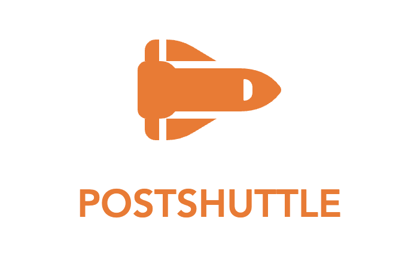

# Postshuttle (Postman-clone)

<p align="center">
    
</p>

A simple version <a href="http://reactjs.org" target="_blank">React</a> app of Postman built on top of <a href="https://vitejs.dev/" target="-blank">Vite</a>.

<br/>

## How To Run Locally
```bash
#Clone the project
$ https://github.com/platosw/postman-clone-react.git

#Go to the project directory
$ cd postman-clone-react

# Install dependencies
$ npm install

# Run the app
$ npm run dev
```
